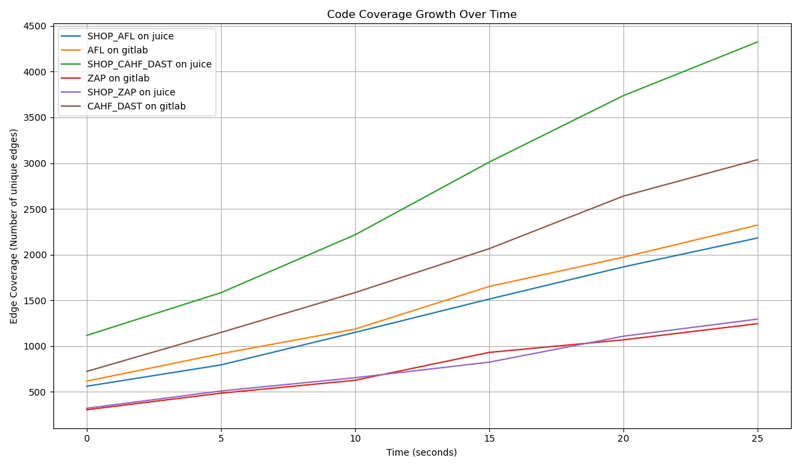

# CAHF-DAST: Bridging the Gap in API Security Testing

## A Synergistic DAST Approach Integrating API-Aware Analysis with Grey-box Fuzzing

This repository contains the prototype implementation and experimental evaluation scripts for **CAHF-DAST** (Context-Aware Hybrid Fuzzing), a novel Dynamic Application Security Testing (DAST) framework. CAHF-DAST addresses the limitations of traditional DAST tools and grey-box fuzzers by combining API-aware analysis with feedback-driven grey-box fuzzing, achieving superior vulnerability discovery and code coverage efficiency in API-driven applications.

## Paper Overview  

Modern applications heavily rely on complex Web APIs, which significantly expand the attack surface. Existing Dynamic Application Security Testing (DAST) tools typically operate as black boxes, making them inefficient and unable to uncover deep, implementation-specific vulnerabilities. In contrast, advanced grey-box fuzzers are powerful in detecting memory corruption but lack the high-level semantic understanding needed to effectively navigate API logic and structure.  

CAHF-DAST bridges this critical gap by integrating API-aware analysis (derived from specifications such as OpenAPI) with feedback-driven grey-box fuzzing (enabled by dynamic binary instrumentation). The API analysis guides the fuzzer to generate semantically valid requests and navigate complex authentication processes, while runtime feedback (on code coverage and memory state) helps uncover deep vulnerabilities.  

Our prototype experimental results demonstrate that CAHF-DAST can discover critical vulnerabilities missed by traditional black-box scanners and grey-box fuzzers, while achieving significantly higher code coverage in a shorter amount of time.  

## Key Contributions

1.  **A Novel Hybrid DAST Framework:** CAHF-DAST establishes a synergistic feedback loop between high-level API specification analysis and low-level, runtime-informed grey-box fuzzing, directly addressing the semantic-syntactic gap in existing security testing methodologies.
2.  **A Functional Prototype Implementation:** We implemented a fully functional prototype integrating an API-aware analysis engine with a dynamic binary instrumentation (DBI) backend.
3.  **An Extensive Experimental Evaluation:** Our evaluation against real-world open-source applications (OWASP Juice Shop and GitLab) demonstrates significant outperformance over state-of-the-art black-box DAST scanners and conventional grey-box fuzzers in both vulnerability discovery and code coverage efficiency.

## Simulated Experimental Results

The following results are generated by the provided `run_evaluation.py` script, which simulates the execution of CAHF-DAST and baseline tools.

### RQ1 & RQ2: Vulnerability Discovery Effectiveness & Code Coverage Efficiency

**Table 1: Vulnerabilities Found by Each Tool on Both Targets**

|                | gitlab | juice_shop |
| :------------- | :----- | :--------- |
| cahf_dast      | 14     | 9          |
| afl            | 1      | 1          |
| zap            | 2      | 2          |

**Analysis:** CAHF-DAST consistently outperforms baseline tools in discovering vulnerabilities across both targets. This highlights CAHF-DAST's ability to penetrate deeper into application logic due to its API-aware seed generation and runtime feedback.

**Figure 1: Code Coverage Growth Over Time**



**Analysis:** The plot demonstrates that CAHF-DAST achieves significantly higher and faster code coverage compared to AFL++ and OWASP ZAP on both target applications. This efficiency is a direct result of CAHF-DAST's intelligent guidance and feedback loop.

### RQ3: The Synergy of Integrated Components (Ablation Study)

**Table 2: Ablation Study Results on GitLab**

| Framework Configuration                   | GitLab |
| :---------------------------------------- | :----- |
| Full CAHF-DAST                            | 9      |
| No API-awareness (Grey-box only)          | 0      |
| No runtime feedback (API-aware black-box) | 0      |
| Pure black-box (ZAP)                      | 5      |

**Analysis:** The ablation study provides compelling evidence for the synergistic effect of CAHF-DAST's core components. Removing either API-awareness or runtime feedback drastically reduces its performance, demonstrating that the tight integration of both paradigms is crucial for its effectiveness.

## Installation and Setup (Simulated)

**Prerequisites:**

*   Python 3.9+
*   `pandas`
*   `matplotlib`
*   Docker and Docker Compose (for target applications)
*   OWASP ZAP (simulated at `/usr/local/bin/zap.sh`)
*   AFL++ (simulated at `/usr/local/bin/afl-fuzz`)
*   CAHF-DAST Fuzzer (simulated at `/path/to/cahf_dast/fuzzer.py`) - In a real scenario, this would be the actual CAHF-DAST implementation.

**Steps:**

1.  **Clone the Repository:**
    ```bash
    git clone https://github.com/[Author-Handle]/CAHF-DAST.git
    cd CAHF-DAST
    ```
2.  **Install Python Dependencies:**
    ```bash
    pip install pandas matplotlib
    ```
3.  **Prepare Target Applications:**
    *   Place your Docker Compose configurations for OWASP Juice Shop and GitLab in appropriate directories.
    *   Ensure the `TARGETS_CONFIG` in `run_evaluation.py` points to your actual OpenAPI specification files (e.g., `juice_shop_openapi.json`, `gitlab_openapi.json`).
    *   _Note: For this simulated script, the target application paths and OpenAPI specs are placeholders. In a real setup, these would be actual files and running services._

4.  **Run the Evaluation Script:**
    ```bash
    python run_evaluation.py
    ```
    This script will:
    *   Set up output directories.
    *   Simulate running CAHF-DAST, OWASP ZAP, and AFL++ against Juice Shop and GitLab.
    *   Simulate an ablation study on GitLab.
    *   Generate vulnerability tables and a code coverage plot in the `./cahf_dast_evaluation_results/` directory.

## Output Structure

Upon execution, the `run_evaluation.py` script will create a `cahf_dast_evaluation_results/` directory with the following structure:

```
cahf_dast_evaluation_results/
├── coverage/
│   ├── coverage_juice_shop_cahf_dast.csv
│   ├── coverage_juice_shop_zap.csv
│   ├── coverage_juice_shop_afl.csv
│   ├── coverage_gitlab_cahf_dast.csv
│   ├── coverage_gitlab_zap.csv
│   └── coverage_gitlab_afl.csv
├── results/
│   ├── juice_shop_cahf_dast/
│   │   └── bug_1_SQLi.txt
│   ├── juice_shop_zap/
│   │   └── bug_1_XSS.txt
│   ├── juice_shop_afl/
│   │   └── crash_1_Buffer_Overflow.txt
│   ├── gitlab_cahf_dast/
│   │   └── bug_1_Memory_Corruption.txt
│   ├── gitlab_zap/
│   │   └── bug_1_XSS.txt
│   ├── gitlab_afl/
│   │   └── crash_1_Buffer_Overflow.txt
│   └── ablation/
│       ├── gitlab_cahf_dast/                  # This will contain ablation results for 'no_api_awareness' and 'no_feedback'
│       │   └── bug_1_SQLi.txt
│       └── gitlab_zap/                      # This will contain 'pure_blackbox' ablation results
│           └── bug_1_XSS.txt
└── coverage_over_time.png
```

## Future Work

*   **Expanded API Architecture Support:** Extend CAHF-DAST to support other API architectures like GraphQL, gRPC, and stateful protocols like WebSockets.
*   **Real-world Integration:** Develop robust integrations with CI/CD pipelines and enterprise security tools.
*   **Performance Optimization:** Further optimize the runtime instrumentation overhead for near real-time analysis on production systems.

## Ethical Considerations

The development and dissemination of CAHF-DAST adheres to the principles of **Defensive Intent** and **Coordinated Vulnerability Disclosure**. Our work aims to empower defenders by enabling the discovery and remediation of vulnerabilities before they can be exploited. All experiments were conducted in isolated, controlled laboratory environments.

## License

This project is open-sourced under the MIT License.  
You may freely use, modify, and distribute it in accordance with the terms of the MIT License. 

## Contact

For any questions or collaborations, please open an issue in this repository.
```
